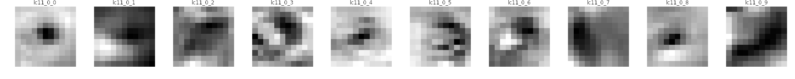

# stcnn

stcnn is a spatiotemporal convolutional neural network written with [Pytorch](https://pytorch.org/) for modeling visual neuron responses to an input movie. We trained the model using published [(Lobula columnar) visual neuron responses](https://doi.org/10.1016/j.neuron.2022.02.013) to a variety of visual stimuli. 

## Getting started

This repository contains code for training the network and visualizing the outputs. 

Package dependencies can be installed via
- <code>pip install -r requirements.txt</code>
- or <code>conda env create --name your_env_name --file environments.yml</code>

## Model Training

To train a model using default configurations, run
<code>python train.py</code>
from the [stcnn/ directory](stcnn/).

Model configuration is specified using [YAML](https://yaml.org/) and loaded using [Hydra](https://hydra.cc/).
- [config.yaml](stcnn/conf/config.yaml) contains core configurations, including training options and parameter bounds
- [dataset directory](stcnn/conf/dataset/) contains configurations for calcium recordings and stimulus movies
- [model directory](stcnn/conf/model/) contains layer setup for lens optics sampling layer, hidden network layers, and celltype specific readout layers

## Dataset and model visualization

Several Jupyter [notebooks](notebooks/) are provided for checking model training and outputs.

- [visualize dataset](notebooks/visualize_dataset.ipynb) loads dataset and creates animations of calcium trace and corresponding stimulus movie

https://user-images.githubusercontent.com/42228341/171505137-d3762ef8-1c72-4345-b1cc-cb0556dbf477.mp4

- [visualize model parameters](notebooks/visualize_model_param.ipynb) plots training loss and convolution filter weights

- [generate ca predictions](notebooks/generate_ca_predictions.ipynb) generates calcium traces for user specified stimulus

## Contributions
This work was supported by the Howard Hughes Medical Institute. [Roman Vaxenburg](https://github.com/vaxenburg) contributed the core convolution code and guidance on the overall model setup. We thank members of the [Turaga lab](https://github.com/TuragaLab) for inputs on the model, especially [Roman Vaxenburg](https://github.com/vaxenburg) and [Janne Lappalainen](https://github.com/lappalainenj). 
